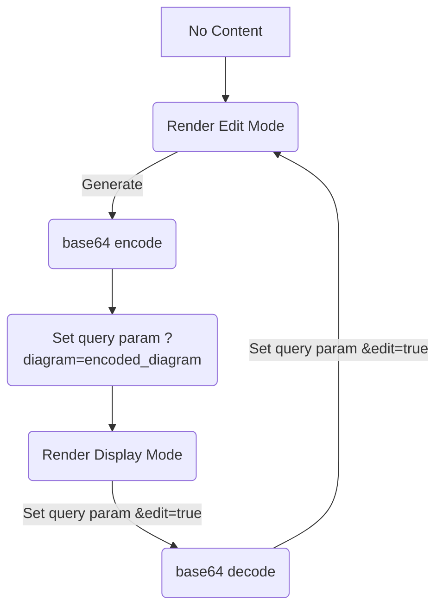

# Mermaid Iframe

This project provides an `iframe` to embed Mermaid diagrams.

## Usage

Open `index.html` in your browser to view the embedded Mermaid diagram.

## Development

To modify the Mermaid diagram, edit the `index.html` file.

## How it Works

This project uses an `iframe` to display Mermaid diagrams. The `index.html` file contains an `iframe` element whose `srcdoc` attribute is dynamically populated with HTML content. This content includes a `div` with the class `mermaid` where the Mermaid diagram definition is placed. The `mermaid.min.js` library is then loaded within the `iframe`'s `srcdoc` to render the diagram.

This approach allows for embedding Mermaid diagrams directly within an HTML page without needing a separate file for the diagram definition or a server to render it.

When index is openend, a textarea and a generate button will be displayed.

The text area accepts code for mermaid diagrams, with a live preview below.

Once generate is pressed, the code will be encoded in base64 and placed in the `diagram` query param.

If this query param is present and filled, the code will attempt to decode it and will display only the diagram.

This is the URL that you can use as an iframe, as it will resolve to the diagram.

If you have this URL and wants to edit the diagram, place another query param `&edit=true`. This will take you back to edit mode, using the current diagram's content.

